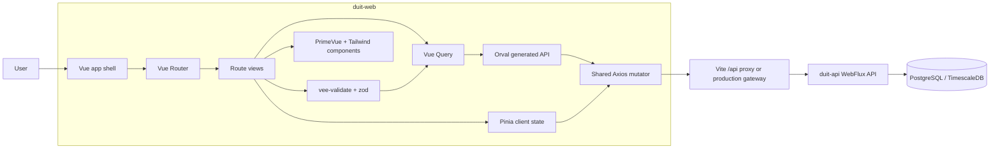
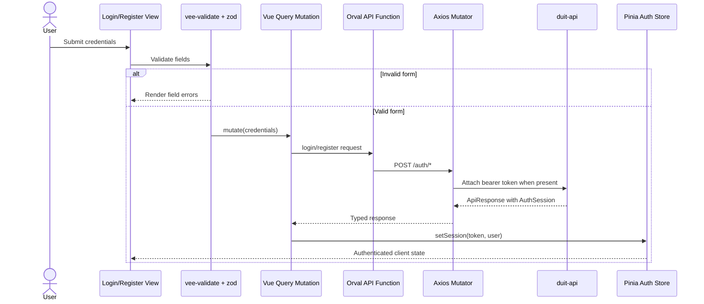

# Duit Web

`duit-web` is the Vue 3 frontend for Duit, an AI-assisted personal finance
application for Southeast Asian users. It handles authentication, transaction
review, receipt capture, insights, anomaly review, statement import, and
collaborative bill-splitting screens.

The frontend is intentionally thin around financial truth: it renders and
validates user interactions, but `duit-api` remains the authoritative system of
record.

## Tech Stack

- Vue 3 Composition API with TypeScript
- Vite for development and production builds
- Vue Router for route-level navigation
- TanStack Vue Query for server state, caching, retries, and mutations
- Pinia for client/session state such as the JWT and authenticated user
- Orval-generated API clients from the backend OpenAPI contract
- Axios with a shared bearer-token interceptor
- vee-validate and zod for form validation
- PrimeVue and Tailwind CSS for UI implementation
- Playwright for browser smoke tests
- Capacitor for Android and iOS native shells

## Architecture



### State Ownership

| Layer | Owns | Does not own |
| --- | --- | --- |
| Vue views/components | Rendering, interaction flow, local UI state | Persisted financial truth |
| vee-validate/zod | Client-side input constraints before API calls | Authorization or final business validation |
| Vue Query | Server state reads, mutations, cache invalidation | Long-lived session identity |
| Pinia | Token, authenticated user, client-only flags | Transactions, bills, receipts as independent truth |
| Orval generated client | Typed endpoint functions from OpenAPI | Hand-written business rules |
| `duit-api` | Authoritative validation, persistence, authorization | Browser-only presentation state |

This split matters because server state is concurrent and shared. Vue Query
keeps network state explicit, while Pinia avoids becoming a second database in
the browser.

## Request Flow



## API Code Generation

The generated API client lives under `src/api/generated/`. It is produced by
Orval from `openapi.json`:

```bash
npm run generate:api
```

`orval.config.ts` uses `src/lib/orvalMutator.ts`, which delegates requests
through the shared Axios instance in `src/lib/api.ts`. That keeps generated
endpoint functions type-safe while preserving JWT attachment and global `401`
handling.

When backend DTOs or endpoints change, regenerate the client and review the
resulting TypeScript diff together with the Kotlin diff. Do not hand-edit files
inside `src/api/generated/`; fix the backend contract or Orval configuration
instead.

## Project Structure

```text
src/
├── api/generated/      Orval generated endpoint functions and models
├── components/         Shared and feature-level Vue components
├── composables/        Vue Query mutations and reusable UI/domain hooks
├── config.ts           Centralized browser constants
├── lib/api.ts          Axios instance and auth interceptor
├── lib/orvalMutator.ts Orval mutator using the shared Axios instance
├── router/             Public and protected route definitions
├── stores/             Pinia client/session state
├── types/              Frontend-only shared types
├── utils/              Formatting and logging helpers
└── views/              Route-level screens
```

Native shells generated by Capacitor live in `android/` and `ios/`. Commit the
native project scaffolding, but do not commit generated web assets, native build
outputs, pods, or machine-local SDK paths.

## Installation

Prerequisites:

- Node.js 20 or later
- npm
- A running `duit-api` backend on `http://127.0.0.1:8080`

Install dependencies:

```bash
npm install
```

Generate the API client after the backend OpenAPI contract changes:

```bash
npm run generate:api
```

Start the frontend:

```bash
npm run dev
```

Vite prints the local browser URL and proxies `/api` requests to
`http://127.0.0.1:8080`.

## Useful Commands

| Command | Purpose |
| --- | --- |
| `npm run dev` | Start the Vite development server |
| `npm run generate:api` | Regenerate Orval clients from `openapi.json` |
| `npm run type-check` | Run `vue-tsc` without emitting files |
| `npm run build` | Type-check and build production assets |
| `npm run test:e2e` | Run Playwright browser smoke tests |
| `npm run lint` | Run ESLint with `--fix` |
| `npm run preview` | Preview the production bundle |

`npm run lint` modifies files because it includes `--fix`; review the diff
before committing.

## Capacitor

The app can be wrapped in native Android and iOS shells:

```bash
npm run build
npx cap sync
npx cap open android
npx cap open ios
```

Capacitor copies the web build into native project folders. Those copied assets
are ignored because they are generated from `dist/`.

## Verification

Run these before pushing frontend changes:

```bash
npm run generate:api
npm run type-check
npm run build
npm run test:e2e
```

For auth and form changes, also verify manually:

1. Start `duit-api`.
2. Start `duit-web` with `npm run dev`.
3. Register or log in through the UI.
4. Confirm validation errors render before invalid requests are sent.
5. Trigger invalid credentials and confirm the API response contains the
   standardized backend error code.

## Security Notes

- JWTs are stored under keys from `src/config.ts`; avoid scattering storage key
  strings through the codebase.
- Do not log receipt images, OCR text, JWTs, API keys, or raw financial records.
- Client validation improves UX but does not replace backend validation.
- Duit does not generate or process payment QR payloads. It may display
  user-provided payment assets only.
