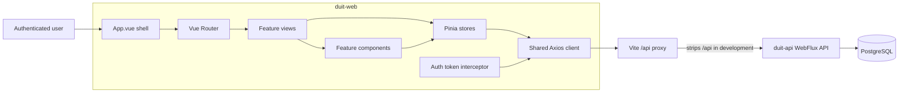
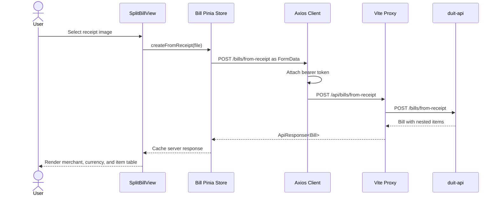

# Duit Web

Vue 3 frontend for Duit, an AI-assisted personal finance application focused on
Southeast Asian users. The frontend presents transactions, receipt capture,
insights, goals, tax views, anomaly review, and draft bill creation.

## Technology

- Vue 3 Composition API and TypeScript
- Pinia for server-state caching
- Vue Router
- Axios
- Vite
- Tailwind CSS

PostgreSQL remains the source of truth through `duit-api`. Pinia stores cache API
responses; they do not independently own persisted financial state.

## Current capabilities

- JWT-based registration, login, logout, and protected navigation
- Transaction creation, editing, deletion, cursor-based browsing, and monthly
  summaries
- Receipt upload, OCR review, transaction confirmation, and pending receipt
  inbox
- Financial insights and anomaly review
- Budget and savings goals
- Business-expense tax summaries
- Draft bill creation from a receipt, including merchant, currency, total, and
  itemized values

## Design principles

- **Server-owned financial data:** stores reflect API responses and are
  refreshed from the backend rather than acting as an independent database.
- **Strict API contracts:** shared resources are modeled in
  `src/types/index.ts`. Kotlin and TypeScript contracts must be reviewed
  together because the project has no code-generation step.
- **Exact monetary transport:** API money values that require preservation are
  represented as decimal strings and formatted only for display.
- **Authenticated ownership:** the browser sends a bearer token; it never sends
  a trusted owner ID for server-owned resources.
- **Phase isolation:** the current split-bill UI creates draft bills only. It
  does not imply sharing, payment, or guest access behavior.

## Frontend architecture



## Split-bill request flow



The bill response uses decimal strings for monetary values so JavaScript does
not become the source of precision loss. `SplitBillView` formats those strings
with the bill's server-provided currency.

## State and API flow

| Layer | Responsibility | Must not do |
| --- | --- | --- |
| Views | Coordinate user interaction and render store state | Persist financial state independently |
| Components | Encapsulate reusable presentation and form behavior | Call unrelated domain APIs |
| Pinia stores | Call APIs, expose loading/error state, cache responses | Generate server IDs or silently rewrite totals |
| Axios client | Apply `/api` base URL, bearer token, and global 401 handling | Contain feature-specific business logic |
| TypeScript contracts | Describe backend request/response shapes | Diverge from Kotlin DTOs |

The shared Axios client redirects to login when the API returns `401`. Other
feature errors remain in the relevant store so the view can render a useful
message.

## Project structure

```text
src/
├── components/     Reusable and feature-level Vue components
├── lib/api.ts      Axios configuration and authentication interceptor
├── router/         Protected application routes
├── stores/         Pinia API-state stores
├── types/          Shared TypeScript API contracts
├── utils/          Currency formatting and logging
└── views/          Route-level views, including SplitBillView.vue
```

## Routes

| Route | View | Purpose |
| --- | --- | --- |
| `/` | `LandingView` | Public landing page |
| `/login` | `LoginView` | Authentication |
| `/dashboard` | `DashboardView` | Financial overview |
| `/transactions` | `TransactionsView` | Transaction management |
| `/inbox` | `InboxView` | Pending receipt review |
| `/insights` | `InsightsView` | Generated financial insights |
| `/tax` | `TaxExportView` | Business-expense tax summary |
| `/goals` | `GoalsView` | Budget and saving goals |
| `/split-bill` | `SplitBillView` | Create a draft bill from a receipt |

Except for `/` and `/login`, navigation requires an authenticated Pinia session.
Backend authorization remains authoritative; the route guard is a user
experience control, not a security boundary.

## Pinia stores

| Store | Server resource |
| --- | --- |
| `auth` | Session token and authenticated user |
| `transaction` | Transactions, categories, and summaries |
| `receipt` | Active receipt upload and confirmation |
| `inbox` | Pending receipt extractions |
| `bill` | Most recently created draft bill |
| `insight` | Generated insights |
| `anomaly` | Anomaly alerts |
| `goal` | Budget and saving goals |
| `tax` | Annual business-expense summary |

## Backend connection

The Axios base URL is `/api`. During development, Vite forwards that prefix to
`http://127.0.0.1:8080` and removes `/api`:

```text
Browser request:  POST /api/bills/from-receipt
Backend receives: POST /bills/from-receipt
```

Production hosting must provide an equivalent `/api` reverse-proxy rule or serve
the frontend and backend behind a gateway with the same contract.

## Local development

Prerequisites:

- Node.js 20 or later
- npm
- `duit-api` running on `http://127.0.0.1:8080`

From `duit-web`, install dependencies:

```bash
npm install
```

Start the development server:

```bash
npm run dev
```

Vite serves the application on its printed local URL and proxies `/api` to the
backend.

## Available commands

| Command | Purpose |
| --- | --- |
| `npm run dev` | Start Vite with API proxying and hot reload |
| `npm run build` | Run `vue-tsc`, then build production assets |
| `npm run preview` | Preview the production bundle locally |
| `npm run lint` | Run ESLint with automatic fixes |
| `npm run format` | Format `src/` with Prettier |

`npm run lint` modifies files because the script includes `--fix`. Review its
diff before committing.

## Verification workflow

Production type/build gate:

```bash
npm run build
```

This runs `vue-tsc` before producing the Vite production bundle.

For the split-bill manual acceptance check:

1. Start PostgreSQL, Redis, and `duit-api`.
2. Configure valid Google Vision and Gemini credentials in the backend.
3. Start `duit-web` with `npm run dev`.
4. Register or log in.
5. Open `/split-bill`.
6. Upload a real receipt and compare merchant, currency, total, quantity, unit
   price, and line total with the image.

## Adding or changing an API-backed feature

1. Confirm the backend DTO and endpoint contract.
2. Add or update the matching interface in `src/types/index.ts`.
3. Put request/loading/error behavior in the relevant Pinia store.
4. Keep presentation and event coordination in the view/component.
5. Reconcile store state from the API after writes.
6. Run `npm run build`.
7. Review the corresponding Kotlin and TypeScript changes together.

## Troubleshooting

### API requests return 404 during development

Confirm Vite is running through `npm run dev`, not by opening generated files
directly. Also confirm the backend listens on `127.0.0.1:8080`; the development
proxy removes `/api` before forwarding.

### The app redirects to login

The Axios response interceptor clears the local session on `401`. Log in again,
then inspect backend authentication logs if the new token is also rejected.

### Receipt or bill upload fails

- Confirm the selected file has an image MIME type and is below the backend
  20 MB in-memory codec limit.
- Check that Google application credentials and the Gemini key are available to
  `duit-api`.
- Read the rendered API error. OCR and invalid bill mappings return typed
  `422` responses rather than generic success states.

### Currency appears as a three-letter code

`formatCurrency` has explicit symbols for MYR, SGD, IDR, and USD. Other
backend-supported currencies fall back to their ISO code, such as `THB 12.40`.

## Security and data handling

- Tokens are attached by the shared Axios interceptor and should never be
  written to logs.
- Receipt images and raw OCR text may contain personal financial data; do not
  add console logging for either.
- The frontend does not generate, validate, or process DuitNow QR payloads.
- Client-side route guards and validation do not replace backend authorization
  and validation.

## Current split-bill scope

Phase 1 creates an authenticated draft bill from a receipt. Sharing,
participants, item claiming, live updates, DuitNow display, and payment
reconciliation are intentionally not implemented yet.

The remaining Phase 1 acceptance item is a credential-backed browser upload
using a real receipt. Phase 2 should not begin until that result has been checked
against the source image.
